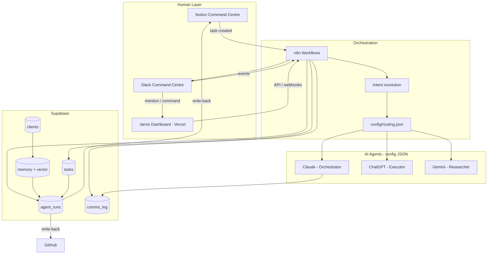
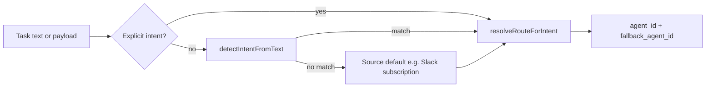
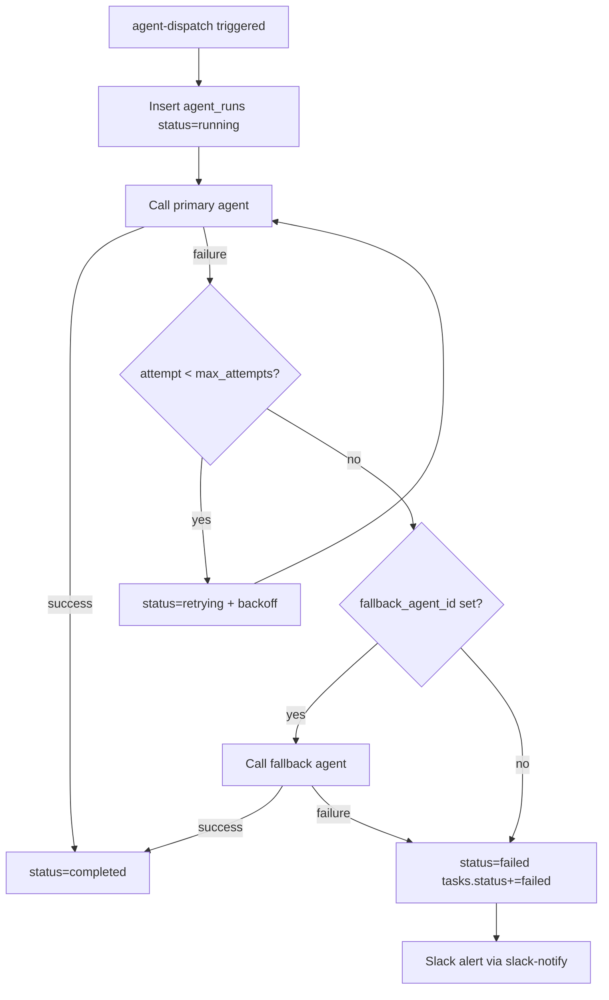

# Jarvis Architecture

## Overview

Jarvis is a **config-first AI agent command centre**. JSON files in `config/` define agents, routing rules, integrations, and workflow metadata. GitHub is the source of truth; Supabase is the runtime system of record; n8n orchestrates cross-service automation; Vercel hosts the dashboard and webhook endpoints.



## Config hierarchy

```
config/
├── system.json              # Global settings, feature flags, paths
├── routing.json             # Intent → agent slug mapping + keyword detection
├── task-status-labels.json  # Allowed values for tasks.status[]
├── agents/*.json            # Agent defs incl. supabase_id UUID + prompt_version
├── integrations/*.json      # Service connection metadata
└── workflows/*.json         # n8n workflow registry
```

Agents are **not** stored in Postgres. Each `config/agents/*.json` file includes a `supabase_id` UUID used as `agent_id` in `agent_runs` and `responsible` in `tasks`.

## Intent classification

Freeform text from Slack, Notion, or GitHub does not arrive with a reliable `intent` field. Resolution happens in `@jarvis/config` before routing:



**Precedence** (highest first):

1. Explicit `intent` in webhook/API payload
2. Keyword detection via `config/routing.json` → `intent_detection.keywords`
3. Source-specific default (e.g. `config/slack/events.json` → `default_intent`)
4. Global default (`intent_detection.default_intent`, currently `orchestrate`)

**Phase 2:** When keyword detection is insufficient (long Notion pages, ambiguous GitHub issues), add an LLM classification step in n8n before `agent-dispatch`. Set `intent_detection.mode` to `llm` in routing config when ready.

**API preview:** `POST /api/health` with `{ "text": "research competitor pricing" }` returns detected intent, agent, and fallback.

## Task lifecycle

1. **Intake** — Task arrives from Notion, Slack (`@jarvis`, `/jarvis`), dashboard, or n8n webhook
2. **Classify** — `resolveIntent()` on headline + description (or explicit intent)
3. **Persist** — Insert into `tasks` (`headline`, `status[]`, `responsible` = agent UUID)
4. **Route** — `routing.json` resolves `intent` → agent slug → `supabase_id`
5. **Execute** — n8n calls LLM; insert `agent_runs` row with status + versioned `details`
6. **Communicate** — Log to `comms_log`; notify Slack channels per `config/slack/channels.json`
7. **Write-back** — On completion, push status/output to Notion and/or GitHub (see below)
8. **Remember** — Optional embeddings in `memory` (pgvector, keyed to `clients`)

## Error handling and retries

The happy path alone is not enough. `agent-dispatch` defines a retry contract in `config/workflows/agent-dispatch.json`:

| `agent_runs.status` | Meaning |
|---------------------|---------|
| `pending` | Queued, not yet started |
| `running` | LLM call in flight |
| `completed` | Usable output produced |
| `failed` | Terminal failure after retries + fallback |
| `retrying` | Backoff before next attempt |

**Failure flow:**



- Primary agent comes from `resolveAgentForIntent()`
- Fallback agent from `resolveFallbackAgentForIntent()` (already in `routing.json`)
- `tasks.status` gains `failed` from `config/task-status-labels.json`
- Each attempt records `attempt`, `error`, and `fallback_from` in `agent_runs.details`

## Prompt versioning

Prompts live in `prompts/` and are referenced by `system_prompt_ref` on each agent config. Each agent also carries a `prompt_version` (semantic version, bumped when the prompt meaningfully changes).

At dispatch time, n8n (or the dashboard preview) calls `buildAgentRunDetails()` from `@jarvis/config`. The returned JSON is stored in `agent_runs.details`:

```json
{
  "agent_slug": "jarvis-claude",
  "intent": "orchestrate",
  "prompt_ref": "prompts/orchestrator.md",
  "prompt_version": "1.0.0",
  "routing_version": "1.0.0",
  "attempt": 1
}
```

Git commit SHA is the ultimate audit trail for prompt files; `prompt_version` is the human-readable label for iteration. See `schemas/agent-run-details.schema.json` and `data/examples/agent-run-details.example.json`.

## Sync and write-back

Intake pulls work **in**; agents must push results **out**:

| Workflow | Direction | Trigger |
|----------|-----------|---------|
| **notion-sync** | Notion → Supabase | Schedule |
| **notion-writeback** | Supabase → Notion | `agent_runs` completed / task done |
| **github-writeback** | Supabase → GitHub | `agent_runs` completed / task done |

Write-back workflows are registered in `config/workflows/` but not yet implemented in n8n. Task `description` can carry a Notion page ID or GitHub issue URL for the write-back step to target.

## Supabase schema

| Table | Purpose |
|-------|---------|
| `clients` | End clients (email, name, country) |
| `tasks` | Work queue — `headline`, `status` (text array), `responsible` (agent UUID) |
| `memory` | Client-linked notes + `vector` embeddings |
| `agent_runs` | Execution records per agent + task (`status`, versioned `details` JSON) |
| `comms_log` | Communications audit trail |

JSON schemas in `schemas/` mirror each table. See `supabase/README.md` for migration notes.

## Security and RLS

Row Level Security is **enabled** on all tables but policies are deferred until Supabase Auth is wired to the dashboard.

**Current posture (safe):**

- Dashboard API routes use `SUPABASE_SERVICE_ROLE_KEY` server-side only
- No browser Supabase client with broad table access yet

**Before going public:**

- Add Supabase Auth to the dashboard
- Add RLS policies scoped to authenticated operators
- Never expose the service role key to the client
- Treat `agent_runs` and `comms_log` as sensitive — they may contain task content and LLM output

## n8n availability

All intake, dispatch, sync, and write-back paths currently run through n8n. If n8n is down, new tasks cannot be dispatched and write-backs stall.

**Options to decide early:**

| Approach | Trade-off |
|----------|-----------|
| **n8n Cloud** (`olune.app.n8n.cloud`) | Managed uptime, less ops |
| **Self-hosted n8n** | More control, you own uptime |
| **Vercel fallback intake** | Slack/dashboard can persist tasks directly via API when n8n is unreachable; dispatch still needs n8n or inline LLM |

Slack events already acknowledge tasks at the Vercel layer; wiring direct Supabase insert there is a viable partial fallback.

## n8n patterns

| Workflow | Trigger | Actions |
|----------|---------|---------|
| **slack-notify** | Supabase insert/update | Format message → Slack `chat.postMessage` → `comms_log` |
| **slack-intake** | Slack event / slash cmd | Validate → `resolveIntent` → insert `tasks` → agent-dispatch |
| **task-intake** | Webhook | Validate JSON → `resolveIntent` → insert `tasks` → log `comms_log` |
| **agent-dispatch** | Supabase / schedule | Route by intent → call LLM → insert `agent_runs` (with retry/fallback) |
| **notion-sync** | Schedule | Pull Notion → upsert `tasks` |
| **notion-writeback** | Supabase update | Push status/output → Notion page |
| **github-writeback** | Supabase update | Comment / close GitHub issue |
| **memory-index** | On completion | Embed notes → upsert `memory.vector` |

## Environment variables

See `.env.example`. Never put secrets in JSON config files.

## Extension points

| Want to… | Edit… |
|----------|-------|
| Add an agent | `config/agents/<name>.json` (set `supabase_id`, `prompt_version`) + `prompts/` + `routing.json` |
| Add task status | `config/task-status-labels.json` |
| Change routing | `config/routing.json` |
| Tune intent keywords | `config/routing.json` → `intent_detection.keywords` |
| Change retry policy | `config/workflows/agent-dispatch.json` → `metadata.retry` |
| Add automation | n8n workflow + `config/workflows/<name>.json` |
| Change DB shape | new migration in `supabase/migrations/` |
