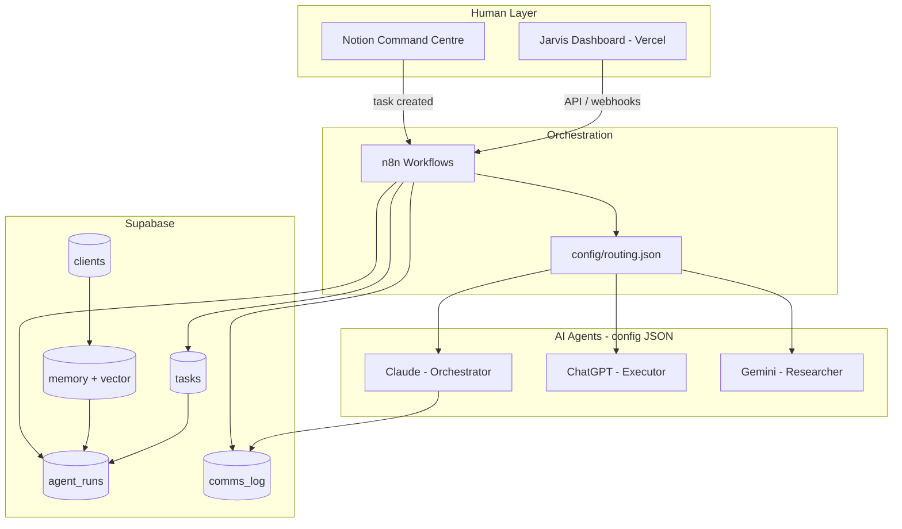

# Jarvis Architecture

## Overview

Jarvis is a **config-first AI agent command centre**. JSON files in `config/` define agents, routing rules, integrations, and workflow metadata. GitHub is the source of truth; Supabase is the runtime system of record; n8n orchestrates cross-service automation; Vercel hosts the dashboard and webhook endpoints.



## Config hierarchy

```
config/
├── system.json              # Global settings, feature flags, paths
├── routing.json             # Intent → agent slug mapping
├── task-status-labels.json  # Allowed values for tasks.status[]
├── agents/*.json            # Agent defs incl. supabase_id UUID
├── integrations/*.json      # Service connection metadata
└── workflows/*.json         # n8n workflow registry
```

Agents are **not** stored in Postgres. Each `config/agents/*.json` file includes a `supabase_id` UUID used as `agent_id` in `agent_runs` and `responsible` in `tasks`.

## Task lifecycle

1. **Intake** — Task arrives from Notion, dashboard, or n8n webhook
2. **Persist** — Insert into `tasks` (`headline`, `status[]`, `responsible` = agent UUID)
3. **Route** — `routing.json` resolves `intent` → agent slug → `supabase_id`
4. **Execute** — n8n calls LLM; insert `agent_runs` row
5. **Communicate** — Log to `comms_log` (messages, delivery status)
6. **Remember** — Optional embeddings in `memory` (pgvector, keyed to `clients`)

## Supabase schema

| Table | Purpose |
|-------|---------|
| `clients` | End clients (email, name, country) |
| `tasks` | Work queue — `headline`, `status` (text array), `responsible` (agent UUID) |
| `memory` | Client-linked notes + `vector` embeddings |
| `agent_runs` | Execution records per agent + task |
| `comms_log` | Communications audit trail |

JSON schemas in `schemas/` mirror each table. See `supabase/README.md` for migration notes.

## n8n patterns

| Workflow | Trigger | Actions |
|----------|---------|---------|
| **task-intake** | Webhook | Validate JSON → insert `tasks` → log `comms_log` |
| **agent-dispatch** | Supabase / schedule | Route by intent → call LLM → insert `agent_runs` |
| **notion-sync** | Schedule | Pull Notion → upsert `tasks` |
| **memory-index** | On completion | Embed notes → upsert `memory.vector` |

## Environment variables

See `.env.example`. Never put secrets in JSON config files.

## Extension points

| Want to… | Edit… |
|----------|-------|
| Add an agent | `config/agents/<name>.json` (set `supabase_id`) + `prompts/` + `routing.json` |
| Add task status | `config/task-status-labels.json` |
| Change routing | `config/routing.json` |
| Add automation | n8n workflow + `config/workflows/<name>.json` |
| Change DB shape | new migration in `supabase/migrations/` |
